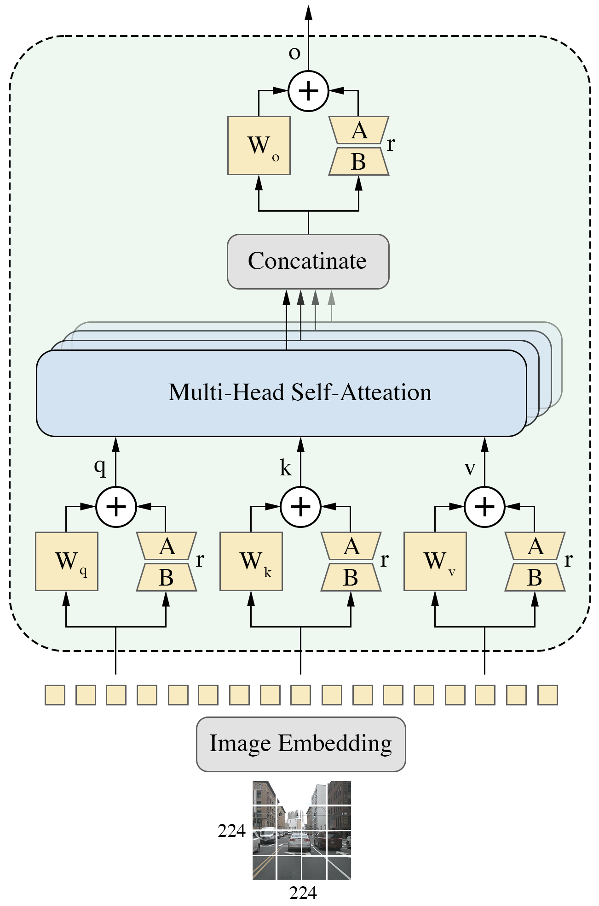

<h1 align="center">
LAHN-DriveCLIP: Localization-Aware CLIP Adaptation with CAM-Guided Hard Negative Mining for Autonomous Driving
</h1>

<p align="center">
<a href="https://imaniraei.github.io/">Iman Iraei</a>,
<a href="https://users.encs.concordia.ca/~omair/">M. Omair Ahmad</a>,
<a href="https://users.encs.concordia.ca/~swamy/">M. N. S. Swamy</a>
</p>

<p align="center">
Department of Electrical and Computer Engineering<br>
Concordia University, Montreal, QC, Canada
</p>

<p align="center">
<a href="#"></a>
<a href="#overview"></a>
<a href="#datasets"></a>
<a href="#"></a>
<a href="#"></a>
<a href="#citation"></a>
</p>

---

# Overview

<p align="center">

</p>

**LAHN-DriveCLIP** is a localization-aware vision-language framework designed for weakly supervised object localization in autonomous driving. The proposed framework extends the CLIP foundation model through parameter-efficient adaptation while preserving the powerful visual-semantic knowledge learned during large-scale pretraining.

Unlike conventional CLIP adaptation methods that primarily optimize global image-text similarity, LAHN-DriveCLIP explicitly incorporates spatial supervision into the learning process. The framework introduces Gaussian CAM Alignment to encourage spatial consistency between class activation maps and object locations, together with a Localization-Aware Hard Negative Mining strategy that emphasizes spatially confusing image-text pairs during contrastive learning.

Instead of fully fine-tuning CLIP, lightweight Low-Rank Adaptation (LoRA) modules are inserted into both the vision and text transformers, allowing efficient domain adaptation while keeping the pretrained backbone frozen. This design substantially reduces computational overhead while improving both localization accuracy and cross-modal retrieval performance.

Extensive experiments demonstrate that LAHN-DriveCLIP consistently outperforms pretrained CLIP and CLIP Surgery across multiple autonomous driving datasets while maintaining interpretable activation maps and strong vision-language alignment.

---

# Method

<p align="center">

</p>

The proposed training pipeline consists of four tightly coupled components:

### 1. LoRA-based CLIP Adaptation

The pretrained CLIP vision encoder and text encoder remain frozen during training. Instead, lightweight Low-Rank Adaptation (LoRA) modules are inserted into the transformer attention layers, allowing efficient adaptation with only a small number of trainable parameters.

---

### 2. Gaussian CAM Alignment

To introduce localization awareness without adding an object detector, LAHN-DriveCLIP generates gScoreCAM activation maps from CLIP similarity scores.

Ground-truth bounding boxes are converted into Gaussian spatial targets, and the generated activation maps are aligned with these targets through a CAM alignment loss, encouraging spatially accurate visual attention while preserving CLIP's original contrastive learning paradigm.

---

### 3. CAM-Guided Hard Negative Mining

Rather than treating all negative image-text pairs equally, LAHN-DriveCLIP identifies difficult negatives according to the spatial overlap between their activation maps.

Image-text pairs producing similar activation regions receive larger weights during contrastive learning, enabling stronger discrimination between visually confusing driving scenes.

---

### 4. Joint Optimization

The final training objective jointly optimizes:

- Contrastive image-text alignment
- Gaussian CAM alignment
- CAM-guided hard negative mining

During optimization, gradients update only the LoRA parameters while the original CLIP backbone remains frozen.

---

# Key Features

- 🚗 Localization-aware adaptation of CLIP for autonomous driving
- 🧠 Parameter-efficient fine-tuning using LoRA
- 🔥 Gaussian CAM Alignment for weakly supervised localization
- 🎯 CAM-guided Hard Negative Mining
- 🌍 Strong cross-domain generalization
- ⚡ Lightweight training with frozen CLIP encoders
- 📈 Improved cross-modal retrieval and localization performance
- 🔍 Interpretable class activation maps

---

# Datasets

The proposed framework is evaluated on four public autonomous driving datasets.

| Dataset | Purpose |
|----------|----------|
| Talk2Car | In-domain training and evaluation |
| BDD-X | Cross-domain retrieval and localization |
| KITTI | Cross-domain localization |
| Udacity Self-Driving Car | Cross-domain localization |

### Official Dataset Links

- Talk2Car Dataset
- BDD-X Dataset
- KITTI Vision Benchmark
- Udacity Self-Driving Car Dataset

---

# Highlights

- Localization-aware CLIP adaptation
- Weakly supervised vision-language grounding
- Frozen CLIP backbone with LoRA adaptation
- Gaussian CAM supervision
- Spatially-aware hard negative mining
- Efficient inference for autonomous driving applications


---

# Repository Structure

```text
LAHN-DriveCLIP/
│
├── assets/
│   ├── pipeline.png
│   ├── LoRA.jpg
│   ├── Talk2Car.jpg
│   ├── BDD100k.jpg
│   ├── average.png
│   ├── iou_barplot.png
│   ├── Localization_Acc_IoU0.5_ViT-L14.png
│   └── Localization_Acc_IoU0.5_RN50.png
│
├── configs/
│
├── datasets/
│
├── losses/
│
├── models/
│
├── notebooks/
│
├── outputs/
│
├── logs/
│
├── scripts/
│
├── utils/
│
├── README.md
├── INSTALL.md
├── DATASETS.md
├── RUN.md
├── requirements.txt
├── LICENSE
└── .gitignore
```

---

# Installation

Please follow the installation instructions provided in **INSTALL.md**.

The installation guide includes

- Environment setup
- Python dependencies
- CUDA compatibility
- GPU requirements
- HPC installation
- Google Colab inference
- Troubleshooting

---

# Data Preparation

The complete dataset preparation procedure is described in **DATASETS.md**.

The repository supports the following autonomous driving datasets

| Dataset | Purpose |
|----------|----------|
| Talk2Car | Training & Evaluation |
| BDD-X | Cross-domain Evaluation |
| KITTI | Cross-domain Evaluation |
| Udacity Self-Driving Car | Cross-domain Evaluation |

The data preparation guide includes

- Download links
- Folder organization
- Annotation format
- Image preprocessing
- Train / Validation split
- Evaluation protocol

---

# Training and Evaluation

Detailed instructions for training and evaluation are provided in **RUN.md**.

Supported workflows include

- Model training
- Evaluation
- Cross-modal retrieval
- Weakly-supervised localization
- Visualization using gScoreCAM
- Inference on custom images
- Benchmark reproduction

---

# Model Architecture

<p align="center">

</p>

The proposed LAHN-DriveCLIP framework consists of four major stages:

1. **LoRA-based CLIP Adaptation**

   Lightweight Low-Rank Adaptation (LoRA) modules are inserted into both the vision and text transformers while the original CLIP backbone remains frozen.

2. **Gaussian CAM Alignment**

   Gaussian spatial targets generated from bounding-box annotations supervise gScoreCAM activation maps, introducing localization awareness without requiring dense pixel-level annotations.

3. **CAM-Guided Hard Negative Mining**

   Spatially confusing image-text pairs are emphasized during contrastive learning based on CAM overlap, improving cross-modal discrimination.

4. **Joint Optimization**

   The localization loss and contrastive learning objective are jointly optimized while updating only LoRA parameters.

---

# LoRA Adaptation

<p align="center">

</p>

LAHN-DriveCLIP employs parameter-efficient Low-Rank Adaptation (LoRA) to adapt both the vision encoder and the text encoder of CLIP.

Instead of updating hundreds of millions of pretrained parameters, only lightweight low-rank matrices are optimized, resulting in

- lower GPU memory usage
- faster convergence
- improved generalization
- negligible computational overhead

This design makes LAHN-DriveCLIP particularly suitable for large-scale autonomous driving applications.

---

# Supported Tasks

The repository provides implementations for

- Vision-language grounding
- Cross-modal retrieval
- Weakly supervised localization
- gScoreCAM visualization
- LoRA fine-tuning
- Hard negative mining
- Cross-domain evaluation

---
